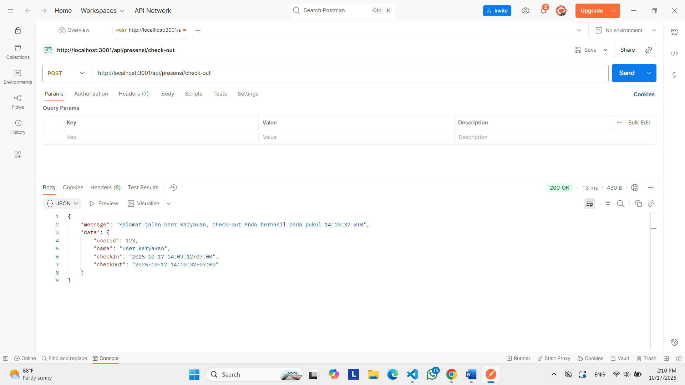
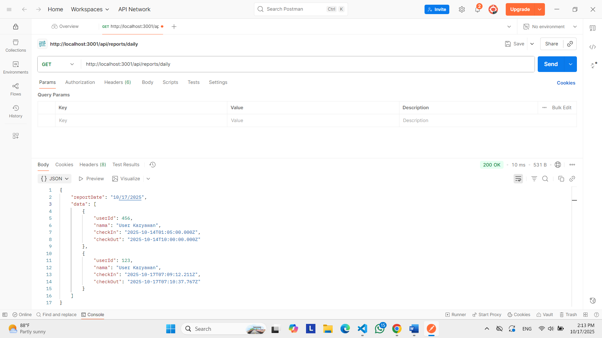

# TUGAS 3

1. Endpoint: POST /api/presensi/check-in 

2. Endpoint: POST /api/presensi/check-in (lebih dari 1 kali)

3. Endpoint: POST /api/presensi/check-out

4. Endpoint: POST /api/presensi/check-out (tanpa check-in)

5. Endpoint: GET /api/reports/daily

